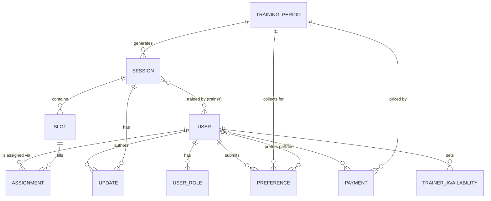

# Tennis Club Training Planner — Specification

Status: draft v1 · Owner: club organiser · Last updated: 2026-07-03

## 1. Purpose

A small, focused web app that lets a local tennis club run its training
seasons without spreadsheets and email chains. It does four things well:

1. The **organiser** defines a training period (dates, weekdays, times, price).
2. **Players** state their preferences (day, partners, skill level) for that period.
3. The **organiser** reviews those preferences and assigns players to concrete
   training slots.
4. Everyone stays in sync: players pay online, and **trainers**/the organiser
   post updates (e.g. cancellations) that reach the right people immediately.

Non-goals for v1 (see [§13 Out of scope](#13-out-of-scope-v1)): automatic
matchmaking, multi-club support, in-app chat, attendance/stats tracking.

Design principles, in priority order:
- **Clarity over cleverness.** Every screen should be understandable without
  a tutorial. Prefer plain tables and lists over dashboards with too many
  widgets.
- **Do less, but do it reliably.** A small feature set, tested well, beats a
  large one that's flaky.
- **Boring, maintainable code.** Popular, well-documented tools; minimal
  custom infrastructure; a codebase a single volunteer developer can keep
  running for years.
- **Tennis, subtly.** Court-line motifs, a tennis-ball accent color, a
  net-shaped divider — never at the cost of legibility.

## 2. Users & Roles

A person is a single `User` account that can hold one or more **roles** in
the club:

| Role | Can do |
|---|---|
| **Organiser** | Create/edit training periods & pricing; invite players & trainers; view all preferences; assign players to slots; view payment status; post/edit updates; manage trainers. |
| **Trainer** | Set their own availability; view rosters for their assigned sessions; post updates about a session (cancel, reschedule, note). |
| **Player** | Manage profile & skill level; submit preferences per training period; view their assigned slot(s); pay online; receive updates. |

A user can be both a player and a trainer (common at small clubs). The
organiser role is granted by an existing organiser — it is not
self-service.

**Membership model (v1):** closed/invite-based. The organiser invites
people by email; they follow a link to set a password (or use a magic
link — see [§9](#9-authentication--security)) and land with the role(s)
they were invited as. This avoids building open registration + approval
workflows and keeps the member list authoritative.

## 3. Domain Glossary

| Term | Meaning |
|---|---|
| **Training Period** | A season definition: start date, end date, a weekly recurrence (e.g. "every Monday & Tuesday, 18:00–22:00"), and a price. |
| **Session** | One concrete calendar occurrence generated from a Training Period (e.g. "Monday 5 Jan 2027, 18:00–22:00"). Can be individually cancelled or edited (e.g. rained out) without affecting the rest of the period. |
| **Slot** | A bookable sub-unit of a Session: a specific court + time range + max player count (e.g. "Court 1, 18:00–19:30, max 4"). A Session usually has multiple Slots so players of different levels aren't all on one court. |
| **Preference** | A player's input for a Training Period: preferred day(s), preferred training partners, self-reported skill level (1–9), free-text notes. |
| **Assignment** | The link between a Player and a Slot, created by the organiser. |
| **Update** | A message posted against a Session or Period by a trainer/organiser (e.g. "cancelled — rain"), which generates notifications. |

## 4. User Flows

### 4.1 Organiser: set up a training period
1. Create a Training Period: name, start/end date, weekday(s) + time range,
   price, currency.
2. App generates the Session list (one per matching weekday in range).
   Organiser can cancel/adjust individual sessions later (holidays, etc.).
3. Organiser opens the period for player preferences (sets a submission
   deadline).
4. Organiser invites trainers and assigns them to sessions or the whole period.

### 4.2 Player: submit preferences & get assigned
1. Player opens the open Training Period and submits preferences: which
   day(s) work, up to N preferred training partners (searched from existing
   members), skill level.
2. Preferences are editable until the deadline.
3. After the deadline, the organiser reviews an overview table (see 4.3)
   and manually assigns each player to a Slot.
4. Once assignments are published, the player sees their Slot(s) on their
   dashboard and gets a notification.
5. Player pays online for the period; dashboard shows payment status.
6. Player receives Update notifications for their sessions (cancellations,
   court changes, notes).

### 4.3 Organiser: assign players to slots
This is the core "hard" screen — it must stay simple even as data grows:
- A table of all players who submitted preferences for the period: name,
  skill level, preferred day(s), preferred partners, current assignment
  (if any).
- Sortable/filterable by day and skill level.
- For each Session, the organiser defines Slots (court, time, capacity),
  then assigns players to a Slot via a simple picker.
- The app flags obvious conflicts inline (slot over capacity, player
  assigned to two overlapping slots) — it does **not** attempt to
  auto-solve them. The organiser decides.
- Assignments can be saved as a draft and published later (players are
  only notified on publish).

### 4.4 Trainer: post a training update
1. Trainer opens their upcoming session.
2. Posts an update (free text) and optionally changes session status
   (Scheduled / Cancelled / Moved).
3. All players assigned to that session (and the organiser) get a
   notification (in-app + email).

### 4.5 Payment
1. Once assignments for a period are published, the app creates one
   Payment record per assigned player for the period's price.
2. Player pays via a hosted checkout (Mollie — see [§8](#8-technical-architecture)).
3. A webhook confirms payment and updates status; player and organiser see
   it reflected immediately.
4. Organiser dashboard shows a paid/unpaid overview per period, with a
   one-click reminder email for unpaid players.

## 5. Data Model

Core entities (fields are indicative, not final):

- **User** — id, name, email, phone, locale (nl/en), skill_level (self
  reported, organiser can override), created_at.
- **UserRole** — user_id, role (organiser/trainer/player), period_id
  (nullable — trainer roles can be period-scoped).
- **TrainingPeriod** — id, name, start_date, end_date, weekday_pattern
  (e.g. `["MON","TUE"]`), start_time, end_time, price, currency,
  preference_deadline, status (draft/open/assigning/published/archived).
- **Session** — id, period_id, date, start_time, end_time, status
  (scheduled/cancelled/moved), location/court note.
- **Slot** — id, session_id, court, start_time, end_time, capacity,
  min_skill, max_skill (optional band).
- **Preference** — id, user_id, period_id, preferred_weekdays[],
  preferred_partner_user_ids[], skill_level, notes, submitted_at.
- **Assignment** — id, slot_id, user_id, assigned_by, assigned_at.
- **Payment** — id, user_id, period_id, amount, currency, status
  (pending/paid/failed/refunded), provider_reference, paid_at.
- **Update** — id, session_id (nullable → period-wide), author_id, body,
  created_at.
- **Notification** — id, user_id, update_id, channel (in_app/email),
  read_at, sent_at.
- **TrainerAvailability** — id, user_id, period_id, available_weekdays[].

### Semantic layer / data dictionary

Every table and column is documented directly in the Prisma schema using
`///` doc comments. A small script (`scripts/generate-data-dictionary.ts`)
renders those comments into `docs/data-dictionary.md` so there is always
one human-readable source of truth for "what does this field mean,"
generated from the schema rather than hand-maintained in two places. This
keeps the semantic layer honest without building a separate metadata
system.

## 6. Screens (indicative)

| Screen | Roles | Purpose |
|---|---|---|
| Dashboard | all | "What's next for me" — upcoming session(s), payment status, recent updates. |
| Training Period setup | organiser | Create/edit a period, its schedule and price. |
| Preferences form | player | Submit/edit preferences for an open period. |
| Assignment board | organiser | The preference table + slot assignment UI (§4.3). |
| Session detail | all (scoped) | Roster, court, time, updates for one session. |
| Payments overview | organiser | Paid/unpaid table per period, send reminders. |
| My payments | player | Personal payment history & status. |
| Members | organiser | List of players/trainers, roles, invite new members. |

Every screen must work well at both a ~375px mobile width and a desktop
width — no feature is desktop-only. Tables collapse to stacked cards on
mobile rather than requiring horizontal scrolling.

## 7. Non-Functional Requirements

- **Clarity & intuitiveness.** No screen should require documentation to
  use. Prefer explicit labels over icons-only controls.
- **Reliability.** Automated tests cover every core flow (§4). CI must
  pass before merge. No known bugs ship — a bug report is a P0 until
  triaged.
- **Performance.** Pages interactive in <2s on a typical mobile
  connection; assignment board stays responsive with a full season's
  worth of players (hundreds, not thousands).
- **Accessibility.** WCAG 2.1 AA: keyboard navigable, sufficient color
  contrast, form labels, focus states.
- **Internationalisation.** UI text in Dutch and English via a single
  translation-key system; Dutch is the default locale, per-user
  switchable.
- **Security & privacy.** See §9.
- **Maintainability.** TypeScript everywhere, one linter/formatter
  config, no framework-hopping. A new contributor should be able to read
  the folder structure and understand where things live without a guide.

## 8. Technical Architecture

Recommendation, optimised for "boring and maintainable" over novelty:

| Layer | Choice | Why |
|---|---|---|
| Framework | **Next.js (App Router) + TypeScript** | One codebase for frontend + backend (server actions/route handlers), huge documentation base, easy to host, easy for future maintainers to pick up. |
| Styling | **Tailwind CSS** | Utility classes keep styling co-located with markup — no separate CSS files to keep in sync. Small custom theme for the tennis accent (court-green, ball-yellow, subtle line-motif dividers). |
| Database | **PostgreSQL** | Relational data (periods → sessions → slots → assignments) maps cleanly to relations; mature, well-understood, cheap managed hosting (Neon/Supabase). |
| ORM | **Prisma** | Type-safe queries, migrations as code, schema doubles as the semantic layer (§5). |
| Auth | **Email magic link** (via NextAuth/Auth.js) | No passwords to hash, reset, or leak — smaller attack surface for a volunteer-run club app. Role checks in middleware/server actions. |
| Payments | **Mollie** | iDEAL support (dominant payment method for Dutch/Belgian clubs) alongside cards; hosted checkout means card data never touches our servers. |
| Email | **Resend** (or comparable transactional provider) | Preference/assignment/update notifications and magic links. |
| i18n | **next-intl** | Type-safe translation keys, NL default / EN toggle. |
| Testing | **Vitest** (unit) + **Playwright** (end-to-end for the flows in §4) | Confidence in the flows that matter without a heavy test pyramid. |
| Hosting | **Vercel** (app) + managed Postgres | Zero-ops deploys, good fit for Next.js, generous free tier for a small club's traffic. |

Folder structure keeps domain logic out of UI components (`/lib` for
business logic and data access, `/app` for routes/UI, `/prisma` for
schema+migrations, `/docs` for this spec and the generated data
dictionary) so the "what" and the "how it's shown" don't get tangled.

## 9. Authentication & Security

- Magic-link auth (no stored passwords); short-lived, single-use tokens.
- Role-based access control enforced server-side on every request — the
  UI hiding a button is never the only guard.
- All traffic over HTTPS; secrets in environment variables, never in code
  or the repo.
- Input validation with a schema library (Zod) at every server boundary.
- Rate limiting on auth and payment-sensitive endpoints.
- Payment data is handled entirely by Mollie's hosted checkout; the app
  only stores a provider reference and status, never card/bank details.
- GDPR-aligned: data minimisation (only what's needed to run trainings),
  a documented data retention period for past seasons, and a way for a
  member to request export/deletion of their data.
- Dependency updates and a basic security review are part of the release
  checklist, not an afterthought.

## 10. Notifications

- Two channels only for v1: **in-app** (a notification list on the
  dashboard) and **email**. No SMS/push — keeps the notification system
  small and reliable.
- Triggers: assignment published, payment received/reminder, session
  update posted (cancellation/change/note).
- Communication is **broadcast, not chat**: organiser/trainer → affected
  players. No 1:1 messaging in v1 — it would add significant moderation
  and privacy surface for little benefit over a phone call/WhatsApp for
  edge cases.

## 11. MVP Scope

In:
- One training period at a time is fully supported (multiple periods can
  exist, e.g. spring/summer, but no overlap-handling complexity beyond
  what the data model already allows).
- Organiser: create period, invite members, review preferences, manually
  assign slots, publish, track payments.
- Player: submit preferences, view assignment, pay, receive updates.
- Trainer: view roster, post updates.
- NL/EN UI.

## 12. Nice-to-haves (post-MVP, not v1)

- Calendar export (.ics) of a player's assigned sessions.
- Automatic assignment suggestions (algorithmic first pass that the
  organiser then adjusts) once the manual flow is proven.
- Attendance tracking and simple season stats.
- Waitlists when a slot is full.

## 13. Out of scope (v1)

- Multi-club / multi-tenant support.
- In-app chat / direct messaging.
- Automatic (unassisted) assignment algorithm.
- SMS notifications.
- Native mobile apps (the web app must simply work well on mobile
  browsers).

## 14. Proposed feature: user/admin sign-in and admin-led training-period planning

> In the current product vocabulary, the requested "admin" corresponds to the existing organiser role. The implementation should keep that role model and expose the admin workflow through the organiser/admin experience.

### 14.1 Goal

The app should support two distinct authentication paths:
- a regular member login for players and trainers, and
- an admin login for the club organiser/admin.

The admin uses the app to create a training period, collect preferences, and later turn that draft into the final published plan.

### 14.2 Functional requirements

#### Authentication and access
- The app must support a clear distinction between a regular user account and an admin account.
- Admin-only screens and actions are protected server-side and cannot be reached by a regular user.
- Admins can invite or create member accounts and assign role(s) as needed.

#### Create a training period
- The admin can create a new training period from a form.
- The form must capture:
  - a period name,
  - the start date and end date,
  - the recurring weekdays (for example Monday and Tuesday),
  - the start and end time,
  - the submission deadline for preferences,
  - the period price and pricing model,
  - the proposed trainer assignment(s) for each recurring session.
- The app must generate one training session for each matching weekday within the selected date range.
- The admin can enter a pricing model that supports a period-based amount and common group-size examples such as:
  - €300 for a 4-person group, or
  - €600 per person for a 2-person group.
- The admin can assign one or more trainers to each proposed session or to the recurring pattern as a whole.
- These trainer assignments are treated as proposed planning input during the preference-collection phase and are not yet considered the final published roster.

#### Collect preferences
- While the period is open, users can view the period and submit their preferences.
- The system should present the proposed schedule and trainer plan to users so they can indicate their preferences in context.
- The admin can review submissions and adjust the proposed trainer assignments before the deadline.

#### Final planning after the deadline
- After the preference deadline passes, the admin must be able to lock the period for final planning.
- The admin can review all submitted preferences and then create the final published plan.
- Final planning must include:
  - the confirmed session schedule,
  - the confirmed trainer assignments,
  - the final price/participant breakdown used for the period.
- Once the final plan is published, users can see their assigned sessions and the app can send notifications.

### 14.3 Acceptance criteria
- An admin can create a new training period from a single form without using spreadsheets or manual follow-up.
- The app generates all recurring sessions from the entered date range and weekdays.
- The admin can save a proposed trainer roster for the period before the preference deadline.
- Regular users can submit preferences for an open period.
- The admin can transition the period from preference collection to final planning after the deadline.
- The final plan is clearly distinguishable from the initial proposed plan.

### 14.4 Data model notes
- The existing TrainingPeriod model should store recurrence, deadline, pricing, and status information.
- The existing TrainingSession model should support both proposed and confirmed trainer assignments.
- The existing Preference model remains the source of truth for players' stated preferences.

## 15. Open Questions

- Exact skill-level definition (1–9): is this club-defined (e.g. Dutch
  tennis "speelsterkte" classes) or a custom scale? Needs a short
  glossary shown next to the input.
- Refund policy when a session is cancelled — partial refund, credit
  toward next period, or none? Affects the Payment state machine.
- Does the organiser need to see trainer availability before assigning
  trainers to sessions, or is that handled outside the app for v1?

---
*This document is the starting point for implementation. Sections 5
(data model) and 8 (architecture) should be treated as the first draft
of the Prisma schema and project scaffold, respectively.*
